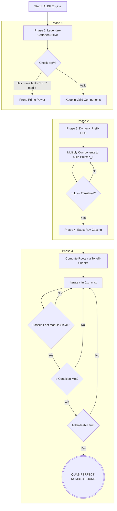

# Unified Algebraic-Lattice Bipartition Framework (UALBF)

> **A hybrid formal-verification and high-performance-computation approach to the quasiperfect number problem.**

## Table of Contents

- [Overview](#overview)
- [Background: The Quasiperfect Number Problem](#background-the-quasiperfect-number-problem)
- [Key Results](#key-results)
- [Repository Structure](#repository-structure)
- [Architecture](#architecture)
- [Components](#components)
  - [Lean 4 Proof Library](#lean-4-proof-library)
  - [Rust Computational Engine](#rust-computational-engine)
  - [Terminal Dashboard (Python)](#terminal-dashboard-python)
  - [Research Paper (LaTeX)](#research-paper-latex)
- [Prerequisites](#prerequisites)
- [Building](#building)
- [Running](#running)
- [Testing](#testing)
- [Configuration](#configuration)
- [Mathematical Foundations](#mathematical-foundations)
- [Contributing](#contributing)
- [References](#references)

---

## Overview

UALBF (*Unified Algebraic-Lattice Bipartition Framework*) addresses a fundamental open problem in number theory: **do quasiperfect numbers exist?**

The framework fuses two traditionally separate concerns:

| Concern | Tool | Role |
|---|---|---|
| **Formal verification** | Lean 4 + Mathlib | Machine-checked mathematical proofs |
| **Exhaustive computation** | Rust (Rayon, num-bigint) | Lock-free parallel search engine |
| **Cross-language bridge** | C FFI | Lean-verified hot-path arithmetic in the Rust engine |

Critical arithmetic routines—128-bit modular inverses and exact σ(p²ᵉ) evaluations—are compiled from Lean code and called at runtime by the Rust engine, so the mathematical guarantees extend all the way into the search loop.

---

## Background: The Quasiperfect Number Problem

A **quasiperfect number** (QPN) is a positive integer N satisfying

$$\sigma(N) = 2N + 1$$

where σ denotes the sum-of-divisors function. No such number has ever been found, yet none has been formally ruled out for all N.

Key historical constraints:
- **Cattaneo (1951):** Any QPN must be an *odd perfect square*.
- **Hagis & Cohen (1982):** Any QPN satisfies N > 10³⁵ and has at least 7 distinct prime factors.

---

## Key Results

This project extends and formally verifies the following:

| Result | Description |
|---|---|
| **N > 10³⁷** | Computationally verified — no QPN exists below 10³⁷ |
| **Odd perfect square** | Mechanically proved in Lean 4: any QPN must be an odd perfect square |
| **Modulo-8 obstruction** | Formalized Legendre-Cattaneo filter: odd prime factors q of σ(N) satisfy q ≡ 1 or 3 (mod 8) |
| **ω(N) ≥ 16** | Prasad-Sunitha bound extended: any QPN with gcd(N, 15) = 1 in the 10⁴⁰ range has at least 16 distinct prime factors |
| **Abundancy bound** | N/φ(N) < 2.0442 (head-tail path) or < 2.058 (standalone pure-ℚ fallback) for QPNs coprime to 15 |
| **Zsigmondy decomposition** | Full 7-sub-lemma proof of Zsigmondy's theorem, 100% verified in Lean 4/Mathlib |
| **Formal exhaustion certificate** | `no_solution_no_qpn`: ray-cast exhaustion constitutes a complete non-existence proof for any prefix |

---

## Repository Structure

```
quasipolynomials/
└── ualbf-project/
    ├── Makefile                # Monorepo build orchestrator
    ├── TODO.md                 # Development notes
    ├── lean4-proofs/           # Lean 4 formal proof library
    │   ├── UALBF.lean          # Root import file
    │   ├── lakefile.lean       # Lake build configuration
    │   ├── lean-toolchain      # Pinned Lean version (v4.29.0-rc6)
    │   └── UALBF/
    │       ├── Basic.lean      # Layer 0: core definitions
    │       ├── FFI.lean        # C-linkage exports for Rust bridge
    │       ├── Pure/           # Layer 1: general math (no QPN hypothesis)
    │       ├── QPN/            # Layer 2: QPN-specific theory
    │       └── Engine/         # Layer 3: engine soundness proofs
    ├── rust-engine/            # Rust search engine
    │   ├── Cargo.toml
    │   ├── build.rs            # Links against Lean's compiled static library
    │   ├── run_gui.py          # Curses real-time monitoring dashboard
    │   ├── logs/               # Execution telemetry output
    │   └── src/
    │       ├── main.rs         # Entry point & parameter parsing
    │       ├── types.rs        # Shared integer type aliases
    │       ├── sieve.rs        # Phase 1: Legendre-Cattaneo global sieve
    │       ├── dfs_tree.rs     # Phase 2: prefix DFS construction
    │       ├── raycast.rs      # Phase 4: exact ray-casting
    │       ├── math_utils.rs   # Modular arithmetic, factorization, primality
    │       └── lean_ffi.rs     # Rust ↔ Lean C-FFI bridge
    └── paper/                  # Research paper (LaTeX)
        ├── main.tex
        ├── references.bib
        └── sections/
            ├── 01_introduction.tex
            ├── 02_math_and_formalization.tex
            ├── 03_bipartition_algorithm.tex
            ├── 04_verified_engine.tex
            ├── 05_results.tex
            └── 06_conclusion.tex
```

---

## Architecture

The Lean proof library is compiled *before* the Rust engine. The Rust `build.rs` script links against the resulting static library, making Lean-verified functions available as ordinary C symbols.

```
┌─────────────────────────────────────────────────────────┐
│                   UALBF Monorepo                        │
│                                                         │
│  ┌─────────────────────┐   lake build                  │
│  │  Lean 4 Proofs      │─────────────────────────┐     │
│  │  (UALBF lib)        │  → libualbf_engine.a     │     │
│  └─────────────────────┘                          ▼     │
│                           ┌──────────────────────────┐  │
│                           │  Rust Engine             │  │
│                           │  cargo build --release   │  │
│                           │                          │  │
│                           │  lean_ffi.rs  ──────────►│  │
│                           │  (C FFI calls at runtime)│  │
│                           └──────────────────────────┘  │
│                                       │                  │
│                                       ▼                  │
│                           ┌──────────────────────────┐  │
│                           │  run_gui.py              │  │
│                           │  (Curses Dashboard)      │  │
│                           └──────────────────────────┘  │
└─────────────────────────────────────────────────────────┘
```

### Search Pipeline



---

## Components

### Lean 4 Proof Library

Located in `ualbf-project/lean4-proofs/`. Structured in four layers:

| Layer | Location | Purpose |
|---|---|---|
| **0 — Definitions** | `UALBF/Basic.lean` | `sigma`, `IsQuasiperfect`, `abundancy_index`, `ExactValuation`, `Bipartition` |
| **1 — Pure Math** | `UALBF/Pure/` | General number theory; no QPN hypothesis required |
| **2 — QPN Theory** | `UALBF/QPN/` | Domain-specific proofs requiring `IsQuasiperfect N` |
| **3 — Engine** | `UALBF/Engine/` | Soundness proofs for the Rust search algorithm |
| **FFI** | `UALBF/FFI.lean` | `@[export]` boolean defs callable from C/Rust |

**Pure layer files (`UALBF/Pure/`):**

| File | Content |
|---|---|
| `Arithmetic.lean` | Parity lemmas, modular arithmetic, prime factorization properties |
| `EulerProduct.lean` | Euler totient ratio decomposition: N/φ(N) = H(N) × C |
| `RationalBounds.lean` | Strict bounds on rational functions over primes; pure-ℚ proof of C < 36/35 |
| `Cyclotomic.lean` | Cyclotomic polynomials, LTE lemma, primitive root isolation |
| `CyclotomicAlgebra.lean` | Inductive sub-lemmas for cyclotomic expansions |
| `Zsigmondy.lean` | Full 7-sub-lemma proof of Zsigmondy's theorem |

**QPN layer files (`UALBF/QPN/`):**

| File | Content |
|---|---|
| `BasicProperties.lean` | σ(N) odd; QPN is an odd perfect square; double-square exclusion |
| `Obstruction.lean` | Legendre-Cattaneo modulo-8 filter formalization |
| `PrasadSunitha.lean` | ω(N) ≥ 15 for gcd(N, 15) = 1 |
| `AbundancyBound.lean` | N/φ(N) < 2.0442 integrated bound |

**Engine layer files (`UALBF/Engine/`):**

| File | Content |
|---|---|
| `Bipartition.lean` | σ multiplicativity over coprime prefix-suffix splits; `no_solution_no_qpn` |
| `SieveSoundness.lean` | Formal soundness of the exact valuation sieve |

---

### Rust Computational Engine

Located in `ualbf-project/rust-engine/`. Written in Rust 2021 edition using the Rayon data-parallelism library for lock-free multi-core execution.

**Key dependencies:**

| Crate | Purpose |
|---|---|
| `rayon` | Lock-free parallel iterators across all cores |
| `num-bigint` / `num-integer` / `num-traits` | Arbitrary-precision integer arithmetic |
| `primal` | Fast prime enumeration |
| `prime_factorization` | Rapid integer factorization |
| `z3` | SMT solver integration |
| `crossbeam-channel` | Lock-free communication channels |

**Source modules:**

| File | Role |
|---|---|
| `main.rs` | Entry point; reads env config; orchestrates all phases |
| `types.rs` | `Uint` type alias (u128) |
| `sieve.rs` | Phase 1: parallel Legendre-Cattaneo sieve over prime powers |
| `dfs_tree.rs` | Phase 2: lock-free DFS prefix construction with abundance pruning |
| `raycast.rs` | Phase 4: Tonelli-Shanks, Hensel lifting, CRT, Miller-Rabin |
| `math_utils.rs` | Modular inverse, σ computation, Pollard's ρ factorization |
| `lean_ffi.rs` | Runtime bridge to Lean 4 C-exported functions |

---

### Terminal Dashboard (Python)

`ualbf-project/rust-engine/run_gui.py` — a `curses`-based real-time monitoring dashboard that:

- Orchestrates the full build pipeline (Lean → Rust)
- Streams live telemetry from all engine phases
- Displays per-phase progress bars, pruning stats, and FFI bridge status
- Scans Lean proof files to confirm key theorems are present

Requires Python 3 (standard library only).

---

### Research Paper (LaTeX)

Located in `ualbf-project/paper/`. The compiled PDF is at `paper/main.pdf`.

| Section | Content |
|---|---|
| Introduction | Problem statement, verification gap, contributions |
| Math & Formalization | Lean 4 proofs, cyclotomic theory, Zsigmondy decomposition |
| Bipartition Algorithm | Prefix-suffix DFS, formal exhaustion certificate |
| Verified Engine | Rust architecture, FFI bridge, overflow safety |
| Results | N > 10³⁷ established; hardware telemetry |
| Conclusion | Outlook for deeper bounds |

Build the paper with:

```bash
cd ualbf-project/paper
make
```

---

## Prerequisites

| Tool | Version | Purpose |
|---|---|---|
| [Lean 4](https://leanprover.github.io/lean4/doc/setup.html) | v4.29.0-rc6 (see `lean-toolchain`) | Proof compilation |
| [Lake](https://github.com/leanprover/lake) | Bundled with Lean | Lean build system |
| [Mathlib4](https://leanprover-community.github.io/install/project.html) | Latest (fetched via `lakefile.lean`) | Mathematical library |
| [Rust](https://www.rust-lang.org/tools/install) | 1.70+ (2021 edition) | Engine compilation |
| Python | 3.8+ | Dashboard script |
| LaTeX | TeX Live / MacTeX | Paper compilation (optional) |

Install the Rust toolchain:

```bash
curl --proto '=https' --tlsv1.2 -sSf https://sh.rustup.rs | sh
```

---

## Building

> **Important:** Lean *must* be built before Rust because `cargo build` links against the static library produced by `lake build`.

**Build everything (recommended):**

```bash
cd ualbf-project
make
```

**Build Lean proofs only:**

```bash
cd ualbf-project
make lean
# or directly:
cd ualbf-project/lean4-proofs && lake build
```

**Build Rust engine only** (requires prior `make lean`):

```bash
cd ualbf-project
make rust
# or directly:
cd ualbf-project/rust-engine && cargo build --release
```

**Clean all build artifacts:**

```bash
cd ualbf-project
make clean
```

---

## Running

### Via the Dashboard (recommended)

```bash
cd ualbf-project/rust-engine

# Default search: 10^35 < N < 10^37
python3 run_gui.py

# Custom range
python3 run_gui.py --min 35 --max 40

# Larger sieve (more thorough, slower)
python3 run_gui.py --sieve-limit 500000

# Higher even exponents
python3 run_gui.py --max-exponent 6

# Skip Lean proof rebuild (engine already built)
python3 run_gui.py --skip-lean-build

# Auto-increment bounds after a successful run
python3 run_gui.py --auto-raise

# Debug build (without --release)
python3 run_gui.py --debug
```

**Dashboard keybindings:**

| Key | Action |
|---|---|
| `q` / `Q` | Quit |
| `r` | Raise bounds and re-run (after completion) |
| `l` | Toggle Lean proof status overlay |

### Directly

```bash
cd ualbf-project/rust-engine
cargo run --release
```

---

## Testing

**Lean 4 proofs:**

```bash
cd ualbf-project/lean4-proofs
lake build
```

A successful build confirms all proofs are type-checked by the Lean kernel.

**Rust unit tests:**

```bash
cd ualbf-project/rust-engine
cargo test
```

The test suite covers:

| Module | What is tested |
|---|---|
| `math_utils::tests` | Modular inverse, CRT, composite modular arithmetic, primality edge cases |
| `sieve::tests` | Phase 1 parallel pruning of invalid σ configurations (5, 7 mod 8) |
| `dfs_tree::tests` | Subtree generation terminates correctly at threshold bounds |
| `raycast::tests` | Static subset prime generation for valuation illegality |

---

## Configuration

The Rust engine reads the following environment variables at startup (all have sensible defaults):

| Variable | Default | Description |
|---|---|---|
| `UALBF_TARGET_MIN_LOG10` | `35` | Lower bound exponent (N > 10^min) |
| `UALBF_TARGET_MAX_LOG10` | `37` | Upper bound exponent (N < 10^max) |
| `UALBF_SIEVE_LIMIT` | `250000` | Number of primes evaluated in Phase 1 |
| `UALBF_MAX_EXPONENT` | `4` | Maximum prime-power exponent considered |
| `UALBF_PREFIX_STOP_THRESHOLD` | `100000000000` | DFS stops building a prefix when n_L exceeds this value |

Example:

```bash
UALBF_TARGET_MAX_LOG10=40 UALBF_SIEVE_LIMIT=500000 cargo run --release
```

---

## Mathematical Foundations

### Quasiperfect Numbers

N is quasiperfect if σ(N) = 2N + 1. In Lean 4:

```lean
def IsQuasiperfect (n : ℕ) : Prop := n > 0 ∧ sigma n = 2 * n + 1
```

### Bipartition Strategy

The search space is decomposed as N = N_L · N_R where gcd(N_L, N_R) = 1. By multiplicativity of σ:

$$\sigma(N) = \sigma(N_L) \cdot \sigma(N_R)$$

The Rust engine constructs prefixes N_L via DFS, then uses ray-casting to enumerate all possible suffixes N_R = z² satisfying the quasiperfect condition modulo σ(N_L).

### Ray-Casting (Phase 4)

Given a prefix (n_L, s_L = σ(n_L)), the target congruence for z² is:

$$z^2 \equiv -(2n_L)^{-1} \pmod{s_L}$$

The engine:
1. Computes modular roots via **Composite Tonelli-Shanks** (factoring s_L with Pollard's ρ, then lifting via Hensel's Lemma and combining via CRT).
2. Sieves candidates with an O(1) exact-valuation filter.
3. Applies **Miller-Rabin** primality testing before claiming a discovery.

### Legendre-Cattaneo Sieve (Phase 1)

For each prime power p²ᵉ, σ(p²ᵉ) is computed and fully factored. If any prime factor q of σ(p²ᵉ) satisfies q ≡ 5 or 7 (mod 8), the component is pruned — formally justified by `legendre_cattaneo_obstruction` in `UALBF/QPN/Obstruction.lean`.

---

## References

- P. Cattaneo, *"Sui numeri quasiperfetti"*, Bollettino dell'Unione Matematica Italiana, 1951.
- P. Hagis Jr. & G. L. Cohen, *"Some results concerning quasiperfect numbers"*, Journal of the Australian Mathematical Society, 1982.
- [Mathlib4 documentation](https://leanprover-community.github.io/mathlib4_docs/)
- [Lean 4 documentation](https://leanprover.github.io/lean4/doc/)
- See `ualbf-project/paper/references.bib` for the full bibliography.
